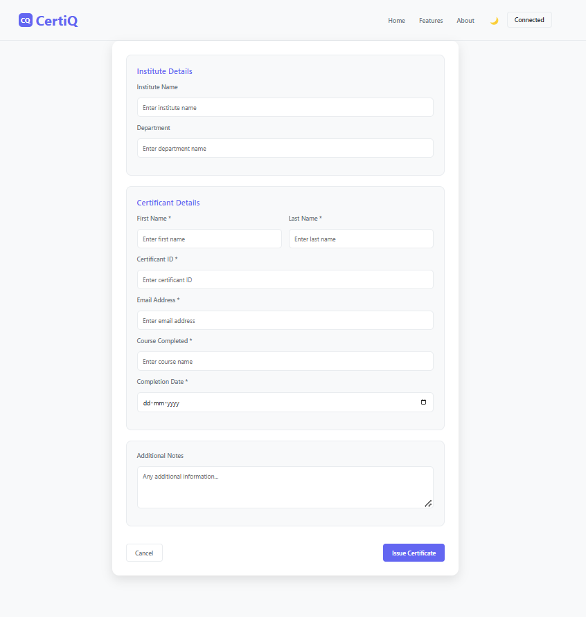
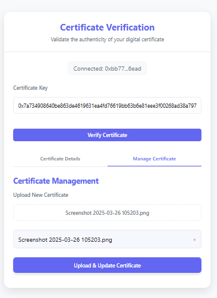
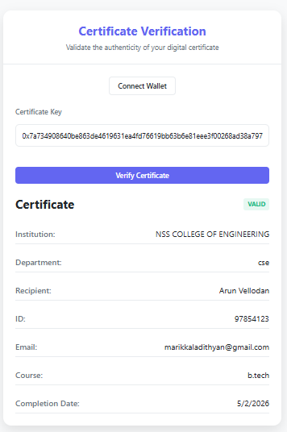

# CertiQ
A Decentralized certificate issuance and verification system using Block chain Technology


DEMO LINK
https://certiq-demos-projects-48a9dfad.vercel.app/
## Basic Details
### Team Name:CertiQ
### Team Guide: Maanasa N A S
### Team Members
- ADITHYAN MARIKKAL NSS22CS009 
- KEERTHANA S NSS22CS037 
- NIYALURAHMAN K K NSS22CS049 
- AMEYA SHYJU M LNSS22CS069 

# Description
Project Title:CertiQ

CertiQ is a decentralized certificate issuance and verification system leveraging the technology of blockchain. CertiQ aims to address key challenges faced in the digital certificate domain, such as forgery and duplication. It ensures the authenticity, transparency, and immutability of certificates providing a secure and efficient solution for credential management.

## Objectives

- Develop a **decentralized, secure, and transparent system** for issuing, managing, and verifying digital certificates.
- Leverage **blockchain** to ensure **immutability** and prevent tampering.
- Use **smart contracts** for automation, reducing administrative overhead.
- Store certificates in **IPFS** for **distributed and reliable storage**.
- Ensure **authenticity, efficiency, and ease of access** while eliminating reliance on centralized authorities.


# Installation and setup
1.Clone the repository:
```bash
 git clone https://github.com/yourusername/yourproject.git
```
2.Install dependencies:
   Open Terminal in the cloned repo CertiQ

```bash
 cd server
 npm install
```
3.Enviroment variables:
  Create .env files inside both server and web-app folders
  
   i. In .env file of server
   ```bash
   ALCHEMY_URL=<Your Alchemy API URL>
   PRIVATE_KEY=<Your admin Wallet Private Key (Do not share!)>
   CONTRACT_ADDRESS=<Your Deployed Smart Contract Address>
   PORT=<Your Preferred Port Number, e.g., 5000>
   PINATA_API_KEY=<Your Pinata API Key>
   PINATA_SECRET_API_KEY=<Your Pinata Secret API Key (Keep Secure!)>
   FRONTEND_URL=<Your Frontend Deployment URL, e.g., http://localhost:3000>
   GMAIL_USER=<Your Gmail Account for Sending Emails>
   GMAIL_PASS=<Your Gmail App Password>
```

ii. In .env file of web-app
   ```bash
   REACT_APP_CONTRACT_ADDRESS=<Your Deployed Smart Contract Address>
   REACT_APP_ALCHEMY_URL=<Your Alchemy API URL>
   VITE_CONTRACT_ADDRESS=<Your Deployed Smart Contract Address>
   VITE_BACKEND_URL=<Your Backend API URL, e.g., http://localhost:5000>    
   VITE_GETABI=<API Endpoint or File Path to Retrieve ABI>
   VITE_VERIFY_URL=<URL for Certificate Verification Page>
```
### Notes:
- Obtain ALCHEMY_URL by creating a project on [Alchemy](https://www.alchemy.com/).
- PRIVATE_KEY should be from your Ethereum wallet (MetaMask or similar).
- CONTRACT_ADDRESS is the address of your deployed smart contract.
- PORT is the backend server's port (default: 5000).
- PINATA_API_KEY and PINATA_SECRET_API_KEY are available from [Pinata](https://www.pinata.cloud/).
- FRONTEND_URL is the deployed frontend or http://localhost:3000 for local development.
- GMAIL_USER is your Gmail address, and GMAIL_PASS should be a Gmail App Password (not your actual password). Refer to [Google App Passwords](https://support.google.com/accounts/answer/185833?hl=en).
- VITE_BACKEND_URL should point to your backend API.
- VITE_GETABI should be an API or file path for the contract ABI.
- VITE_VERIFY_URL is the frontend page for certificate verification.

*Security Tip:*  
Do *not* share your .env files or push them to version control. Add .env to .gitignore to prevent accidental exposure.

4. Compile the smart contract
   ```bash
   cd server
   npx hardhat compile
   ```
5. Deploy to Polygon Amoy Testnet
   ```bash
   npx hardhat run scripts/deploy.js --network polygonAmoy
   ```
6. Start the server
   ```bash
   node server
   ```
7. Open new Terminal
   ```bash
   cd web-app
   npm install
   npm run dev
   ```

# Images of working





# Technical Stack
Frontend:
• Html
• Css
• Java script
• React

IDE:
• VS code
• Remix ide

Backend:
• Solidity
• Node.js
• Express.js
• Hardhat

Version Control:
• Github

# Contributors
- ADITHYAN MARIKKAL  
- KEERTHANA S 
- NIYALURAHMAN K K 
- AMEYA SHYJU M 


